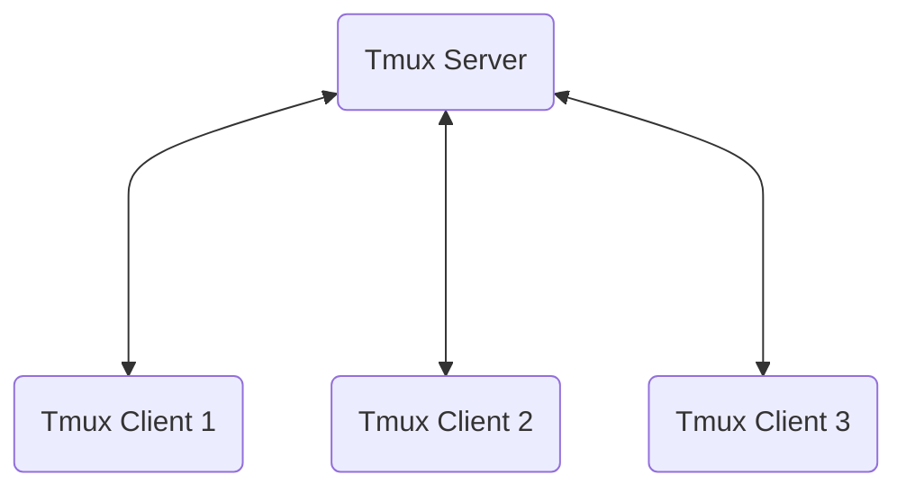

# WHY WE NEED TMUX IN 2023

If you're a software developer, an DevOps engineer, or someone working on Unix systems everyday, then you will need a terminal simulator as much as you need food to survive.

It's 2023 and we have a bunch of options for a terminal simulator such as Terminal, iTerm, Kitty, Xterm, st, Alacritty. They are all awesome with tabs, fonts, keybindings, etc. **Then why the heck do we still use Tmux?**
Bear with me until the end of this series and you might find tmux as interesting as I do.

This article is by no mean to play the role of tmux man page. It rather be guidelines for those who want to start with tmux to understand it well enough to learn more.

## What is Tmux?
Tmux stands for Terminal Multiplexer.
It helps you simply and quickly open multiple terminals on your screen with a clear simple view, again, quickly and simply.

## What does Tmux support?

- Running as a terminal (definitely)
- Running multiple terminal windows (yeah!)
- Running multiple sessions (it's really helpful when you work on multiple projects concurrently)
- Configurable status bar
- No mouse and pointer needed (More productive without moving your hand back and force between your keyboard and mouse)
- Easily scripted for everything (Script is always powerful)

## How Tmux works?
Tmux is built in server-client client model. Which means it has a server and one or more clients.

### Server - Client
When you run tmux (for example, running the command `tmux`), if there is no tmux server running, a new Tmux server will starts in the background. As you can imagine, this server will do everything you would expect to work with the shell and your OS. Tmux client is just a component for user communication.

### Session
Tmux always need a or more sessions. You can say a session is a group of all terminals that you want to work with. So you can have one session for your personal projects, another session for your job at the company, another session for learning to be a hacker, and so on.

### Window and Panes
Inside a session, you can create multiple Tmux windows. A tmux window is basically a full viewport of your screen. A window can be split into multiple Tmux panes.
For example you're working on two git repositories. Then you can open a window for each repository. Inside each window, you can have multiple panes for different purposes at the same time (viewing different code files, listing files in a directory, viewing man page of a tool, checking system status, etc.)

## Enough theory, let's try it

**Installation**

It's so easy and I believe that you can follow [the guidelines here](https://github.com/tmux/tmux/wiki/Installing) to install it using your favorite package manager

### Start tmux

